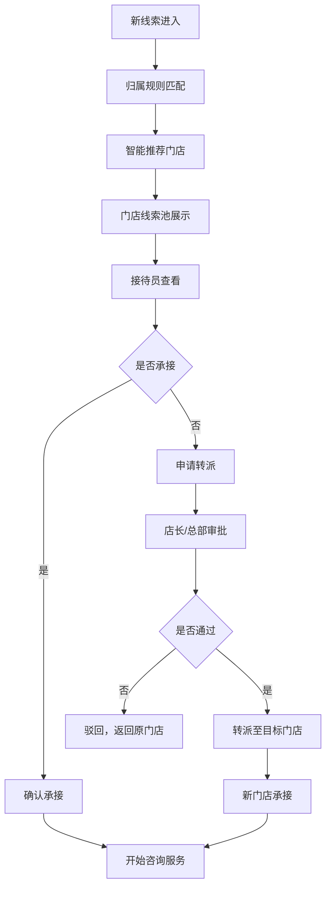
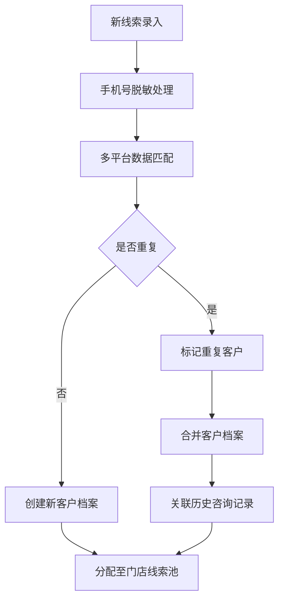

## 1. 产品概述

面向连锁医美品牌的美团/新氧线索分店协同管理后台，解决多城市门店同时接待咨询时的线索分配、跨店转派、重复识别和经营分析问题。

- 核心价值：总部统一管控规则，门店灵活承接线索，避免抢客漏客，提升线索转化效率
- 目标用户：医美品牌总部运营人员、各门店接待咨询师、医生排班管理员

## 2. 核心功能

### 2.1 用户角色

| 角色 | 登录方式 | 核心权限 |
|------|----------|----------|
| 总部管理员 | 账号密码登录 | 配置规则、查看全部门店数据、经营报表、导出权限管理 |
| 门店店长 | 账号密码登录 | 管理本店线索池、审批转派申请、查看门店报表 |
| 接待咨询师 | 账号密码登录 | 承接/转派线索、记录咨询内容、发起预约 |
| 排班管理员 | 账号密码登录 | 管理医生档期、确认到院预约 |

### 2.2 功能模块

1. **总部规则**：城市与项目归属配置、线索分配规则、转派审批流程、敏感数据权限设置
2. **门店线索池**：新线索列表、待承接提醒、智能推荐门店、线索详情与聊天记录
3. **跨店转派**：转派申请、转派审批、聊天摘要迁移、顾客偏好同步
4. **预约排班**：医生档期管理、到院预约、指定医生/设备需求记录
5. **重复客户识别**：手机号去重、多平台线索合并、重复咨询标记
6. **经营报表**：门店响应速度、承接饱和度、跨城投放效果、升级提醒

### 2.3 页面详情

| 页面名称 | 模块名称 | 功能描述 |
|----------|----------|----------|
| 登录页 | 登录模块 | 账号密码登录、角色选择、记住登录态 |
| 工作台首页 | 数据概览 | 今日线索量、待处理数、门店饱和度、预警提醒 |
| 总部规则页 | 规则配置 | 城市项目映射表、分配规则设置、转派流程配置、数据权限管理 |
| 门店线索池页 | 线索列表 | 线索卡片列表、筛选条件、智能推荐标签、一键承接 |
| 线索详情页 | 详情面板 | 顾客信息、聊天记录、咨询项目、偏好标签、操作按钮 |
| 跨店转派页 | 转派管理 | 转派申请列表、审批操作、转派历史、聊天摘要预览 |
| 预约排班页 | 排班日历 | 医生周/月视图、可约档期、预约记录、设备占用 |
| 重复客户页 | 去重识别 | 重复客户列表、合并操作、多平台来源标记 |
| 经营报表页 | 数据报表 | 响应速度统计、承接率分析、跨城投放效果、导出报表 |
| 门店管理页 | 门店档案 | 门店列表、城市分布、接待能力配置 |

## 3. 核心流程

### 3.1 线索分配流程

新线索进入系统 → 根据城市和意向项目匹配归属规则 → 系统推荐最近门店 → 门店接待员查看并承接 → 如无法承接则申请转派 → 店长/总部审批 → 转派至目标门店 → 新门店承接并查看聊天摘要

### 3.2 重复客户识别流程

新线索录入 → 手机号脱敏匹配 → 检测美团/新氧多平台记录 → 标记重复客户 → 合并客户档案 → 展示历史咨询记录

## 4. 用户界面设计

### 4.1 设计风格

- **主色调**：深青色（#0F766E）作为品牌主色，体现医疗专业感；玫瑰金色（#F59E0B）作为强调色，呼应医美美学
- **辅助色**：浅灰背景（#F8FAFC）、白色卡片（#FFFFFF）、边框浅灰（#E2E8F0）
- **按钮风格**：圆角6px，主按钮填充深青色带悬停渐变，次按钮白底灰边
- **字体**：标题使用"Noto Sans SC"加粗，正文使用系统中文字体，字号层级清晰
- **布局风格**：左侧导航栏 + 顶部工具栏 + 右侧内容区的经典后台布局，卡片式内容展示
- **图标风格**：线性风格图标，使用lucide-react图标库，与深青色主色统一

### 4.2 页面设计概览

| 页面名称 | 模块名称 | UI元素 |
|----------|----------|--------|
| 工作台 | 数据概览 | 4个统计卡片、趋势图表、待办列表、预警通知 |
| 门店线索池 | 线索列表 | 顶部筛选栏、卡片式线索列表、智能推荐标签、操作按钮组 |
| 线索详情 | 详情抽屉 | 左右分栏布局，左侧顾客信息，右侧聊天记录和时间线 |
| 跨店转派 | 转派列表 | 表格视图、状态标签、审批操作按钮、摘要展开面板 |
| 预约排班 | 日历视图 | 周/月切换、医生时间轴、可约时段色块、预约弹窗 |
| 经营报表 | 数据图表 | 多维度筛选、柱状图/折线图、数据表格、导出按钮 |

### 4.3 响应式

- 桌面端优先设计，最低支持1280px宽度
- 平板端自适应调整侧边栏收起状态
- 不强制支持移动端，后台系统以桌面操作为主

### 4.4 交互细节

- 卡片悬停有轻微上浮和阴影加深效果
- 状态标签使用不同背景色区分：待处理橙色、进行中蓝色、已完成绿色、已驳回红色
- 表格行悬停高亮，支持斑马纹
- 模态框采用淡入淡出动画，抽屉从右侧滑入
- 数据加载使用骨架屏占位
- 重要操作前有二次确认弹窗
