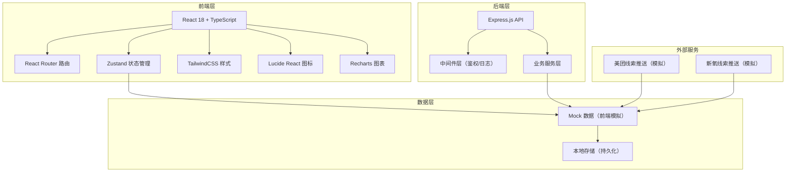
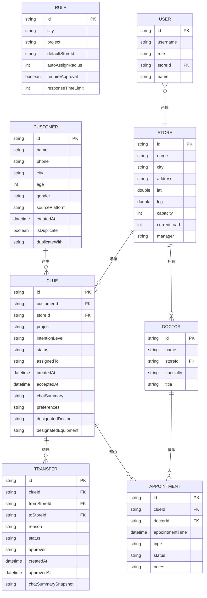

## 1. 架构设计



## 2. 技术描述

- **前端框架**：React 18 + TypeScript
- **构建工具**：Vite 5
- **样式方案**：TailwindCSS 3
- **状态管理**：Zustand
- **路由管理**：React Router DOM 6
- **图标库**：Lucide React
- **图表库**：Recharts
- **后端**：Express.js 4 + TypeScript
- **数据方案**：前端 Mock 数据 + 本地存储（演示用）
- **初始化工具**：vite-init

## 3. 路由定义

| 路由路径 | 页面名称 | 权限要求 |
|----------|----------|----------|
| /login | 登录页 | 公开 |
| /dashboard | 工作台首页 | 登录用户 |
| /rules | 总部规则 | 总部管理员 |
| /clues | 门店线索池 | 门店接待/店长 |
| /clues/:id | 线索详情 | 门店接待/店长 |
| /transfer | 跨店转派 | 门店店长/总部 |
| /schedule | 预约排班 | 排班管理员 |
| /duplicate | 重复客户识别 | 总部管理员 |
| /reports | 经营报表 | 总部管理员 |
| /stores | 门店管理 | 总部管理员 |

## 4. 数据模型

### 4.1 核心数据实体



### 4.2 数据字段说明

| 实体 | 字段 | 类型 | 说明 |
|------|------|------|------|
| Customer | id | string | 客户ID |
| Customer | name | string | 客户姓名 |
| Customer | phone | string | 手机号（脱敏展示） |
| Customer | city | string | 所在城市 |
| Customer | sourcePlatform | string | 来源平台：美团/新氧 |
| Customer | isDuplicate | boolean | 是否重复客户 |
| Clue | id | string | 线索ID |
| Clue | status | string | 状态：待承接/已承接/转派中/已到院/已流失 |
| Clue | intentionLevel | string | 意向度：高/中/低 |
| Clue | chatSummary | string | 聊天摘要 |
| Clue | preferences | string | 顾客偏好标签 |
| Transfer | status | string | 转派状态：申请中/已通过/已驳回 |
| Store | capacity | int | 最大接待容量 |
| Store | currentLoad | int | 当前承接数 |
| Rule | responseTimeLimit | int | 响应时限（分钟） |

## 5. 前端组件结构

```
src/
├── components/
│   ├── layout/
│   │   ├── Sidebar.tsx          # 侧边导航
│   │   ├── Header.tsx           # 顶部栏
│   │   └── PageContainer.tsx    # 页面容器
│   ├── common/
│   │   ├── Button.tsx           # 按钮组件
│   │   ├── StatusTag.tsx        # 状态标签
│   │   ├── Card.tsx             # 卡片组件
│   │   ├── Modal.tsx            # 弹窗
│   │   ├── Drawer.tsx           # 抽屉
│   │   └── Table.tsx            # 表格
│   └── business/
│       ├── ClueCard.tsx         # 线索卡片
│       ├── ClueDetail.tsx       # 线索详情
│       ├── TransferItem.tsx     # 转派条目
│       ├── ScheduleCalendar.tsx # 排班日历
│       └── StatCard.tsx         # 统计卡片
├── pages/
│   ├── Login.tsx                # 登录页
│   ├── Dashboard.tsx            # 工作台
│   ├── Rules.tsx                # 总部规则
│   ├── CluePool.tsx             # 门店线索池
│   ├── ClueDetail.tsx           # 线索详情页
│   ├── Transfer.tsx             # 跨店转派
│   ├── Schedule.tsx             # 预约排班
│   ├── DuplicateCustomer.tsx    # 重复客户识别
│   ├── Reports.tsx              # 经营报表
│   └── StoreManagement.tsx      # 门店管理
├── store/
│   ├── useAuthStore.ts          # 鉴权状态
│   ├── useClueStore.ts          # 线索数据
│   ├── useStoreStore.ts         # 门店数据
│   └── useRuleStore.ts          # 规则配置
├── mock/
│   ├── customers.ts             # 客户mock数据
│   ├── clues.ts                 # 线索mock数据
│   ├── stores.ts                # 门店mock数据
│   └── users.ts                 # 用户mock数据
├── utils/
│   ├── format.ts                # 格式化工具
│   └── storage.ts               # 本地存储
├── types/
│   └── index.ts                 # 类型定义
├── App.tsx
├── main.tsx
└── index.css
```

## 6. 状态管理设计

使用 Zustand 管理全局状态，按业务领域拆分多个 store：

- **useAuthStore**：登录状态、当前用户信息、权限判断
- **useClueStore**：线索列表、线索详情、转派记录、筛选条件
- **useStoreStore**：门店列表、门店饱和度、门店详情
- **useRuleStore**：分配规则、转派流程配置、数据权限配置

## 7. 权限控制

基于角色的前端路由守卫 + 操作级权限控制：

- 路由级别：在路由配置中声明所需角色，未授权跳转登录页
- 操作级别：根据用户角色控制按钮/菜单的显示隐藏
- 数据级别：门店角色仅能查看本店数据，总部可查看全部

## 8. 敏感数据保护

- 手机号中间四位脱敏展示（138****8888）
- 导出功能需总部管理员审批，记录导出日志
- 敏感信息不存储在 localStorage，仅存内存中
- 页面关闭自动清除敏感数据
